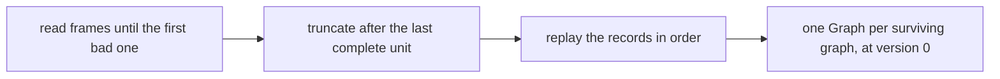

# Durability and recovery

Graphs live in memory. A **write-ahead log** (WAL) makes them durable. It is an append-only file, and every commit is
written to it before readers can see the commit. Opening a database replays the log to rebuild every graph. The
code is in `graph.wal`.

## The data directory

`GraphDB.open(path)` uses one directory (by default `./graphdb-data`) containing:

- `wal.log`: the write-ahead log, shared by every graph in the database;
- `LOCK`: a file the open database holds an exclusive lock on, so no second `GraphDB` can open the same directory.
  The lock is on a separate file because Windows file locks are mandatory, and a lock on the log itself would stop
  the engine from reading it.

## What the log contains

The log is a short header followed by a sequence of records. Each record is stored as a **frame** with a length
and a CRC32 checksum, so recovery can tell exactly where valid data ends if a crash cut a write short.

There are two kinds of entry:

- **Graph created** and **graph dropped**, each a single record.
- **A committed transaction**, stored as one contiguous block: a *begin* record, the transaction's operations in
  order, then a *commit* record. The operations are the transaction's operation list (see
  [Transactions](transactions.md#staging-writes)).

### Attribute values

Each attribute value is written with a type tag, so it is read back with exactly the same type (an `Integer` stays
an `Integer`). Supported types are `null`, `Boolean`, `Integer`, `Long`, `Float`, `Double`, `String`, and `List`
and `Map` values nested to any depth. The type is checked only when the commit is logged. A value of any other type
is accepted when it is staged, then makes `commit()` fail with `WalException`.

## Writing a commit

All graphs in a database share one log, and appends are synchronized so blocks never interleave. To append a
commit:

1. Encode the whole block in memory. An unsupported value fails here, before the file is touched.
2. Write the block at the end of the file.
3. Force it to disk (`fsync`).
4. Return, so the commit path can publish the new snapshot.

Creating or deleting a graph appends its record the same way.

### Write failures

If the write or the `fsync` fails, the log truncates the file back to where the block started and throws
`WalException`, and the commit is not published. If that truncation also fails, the log marks itself failed and
refuses every later append until the database is reopened.

## Recovery

Recovery runs when `GraphDB.open` is called:

1. **Read.** The header is checked first. A wrong or incomplete header stops `open` with an error instead of
   risking a bad recovery. Then frames are read in order until one is cut short, fails its checksum, or cannot be
   decoded.
2. **Truncate.** The valid log ends at the last **complete unit**: a graph record, or a transaction's commit
   record. A transaction whose commit record never reached the disk is discarded. If anything was discarded, the
   file is truncated so new commits never follow garbage.
3. **Replay.** The records are applied in order. Graph records create or forget a graph. A transaction block
   applies its operations through the same snapshot builder the original commit used (see
   [Storage](storage.md#writes-are-defined-for-every-input)). A transaction for a graph that does not exist at that
   point in the log is skipped.

Replay is redo-only. A transaction is logged only after it passes validation, so recovery never needs to undo
anything. Commits are logged in the order they were published, so replay rebuilds the same sequence of states
readers saw.

## What the log does not do yet

- There are no checkpoints. The log grows with every commit, and opening a database replays all of it.
- Standalone graphs, made with `Graph.createGraph()`, never write to it.

[Guarantees and limits](guarantees.md#limits) lists what durability does not cover today.
