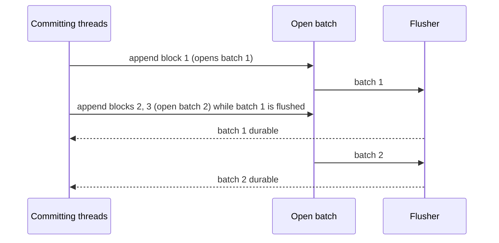
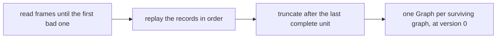

# Durability and recovery

Graphs live in memory. A **write-ahead log** (WAL) makes them durable. It is an append-only file, and every commit is
written to it before readers can see the commit. Opening a database replays the log to rebuild every graph. The
code is in `graph.wal`.

## The data directory

`GraphDB.open(path)` uses one directory (by default `./graphdb-data`) containing:

- `wal.log`: the write-ahead log, shared by every graph in the database;
- `LOCK`: a file the open database holds an exclusive lock on, so no second `GraphDB` can open the same directory.
  The lock is on a separate file because Windows file locks are mandatory, and a lock on the log itself would stop
  the engine from reading it.

## What the log contains

The log is a short header followed by a sequence of records. Each record is stored as a **frame** with a length
and a CRC32 checksum, so recovery can tell exactly where valid data ends if a crash cut a write short.

There are two kinds of entry:

- **Graph created** and **graph dropped**, each a single record.
- **A committed transaction**, stored as one contiguous block: a *begin* record, the transaction's operations in
  order, then a *commit* record. The operations are the transaction's operation list (see
  [Transactions](transactions.md#staging-writes)).

### Attribute values

Each attribute value is written with a type tag, so it is read back with exactly the same type (an `Integer` stays
an `Integer`). Supported types are `null`, `Boolean`, `Integer`, `Long`, `Float`, `Double`, `String`, and `List`
and `Map` values nested to any depth. The type is checked only when the commit is logged. A value of any other type
is accepted when it is staged, then makes `commit()` fail with `WalException`.

## Writing a commit

All graphs in a database share one log. Writing a commit is split between the committing thread and one flusher
thread, which is the only thread that writes to the file:

1. **Encode.** The committing thread encodes the whole block in memory. An unsupported value fails here, before
   anything is appended.
2. **Append.** It adds the block to the log's open batch. If no batch is open, it opens one and queues it for the
   flusher.
3. **Flush.** The flusher takes the batch, so later blocks start the next one, writes every block in it to the end
   of the file, and forces them to disk with one `fsync`.
4. **Wake.** Every commit in the batch learns that it is durable, so the commit path can publish its snapshot.

Blocks join a batch in the order they are appended, and batches are flushed one at a time in the order they were
opened, so the file holds blocks in append order and never interleaves them. A batch spans graphs. Creating or
deleting a graph appends its record the same way and waits until it is durable.

Closing the database stops new appends, waits until every batch already appended has been flushed, and then closes
the file.

### Write failures

A failed write or `fsync` stops the log. After an `fsync` error the operating system may have dropped the data
it could not write while a later `fsync` reports success, so carrying on would risk acknowledging commits that are
not on disk. When a batch fails:

- every commit, graph creation and graph deletion in that batch fails with `WalException`, and so does everything
  queued after it, whichever graph it belongs to;
- the log refuses every later write, to every graph, until the database is reopened;
- nothing that failed is published, and reads keep working on the last published snapshots;
- the log tries to truncate the file back to where the batch started, but cannot prove it succeeded, so the failed
  batch may still be replayed on restart (see [Limits](guarantees.md#limits)).

The `WalException` message says what happened to that write: it was in the failed batch and may or may not survive
a restart, or it came after the failure and was not written. Its cause is the original I/O error.

To recover, close the database, fix the cause (a full disk, say), and reopen it. Recovery restores every
acknowledged commit and drops a torn tail. Then redo the failed writes that still matter, checking first whether
they came back.

## Recovery

Recovery runs when `GraphDB.open` is called:

1. **Read.** The header is checked first. A wrong or incomplete header stops `open` with an error instead of
   risking a bad recovery. Then frames are read in order until one is cut short, fails its checksum, or cannot be
   decoded. The valid log ends at the last **complete unit**: a graph record, or a transaction's commit record. A
   transaction whose commit record never reached the disk is discarded.
2. **Replay.** The records are applied in order. Graph records create or forget a graph. A transaction block
   applies its operations through the same snapshot builder the original commit used (see
   [Storage](storage.md#writes-are-defined-for-every-input)). A transaction for a graph that does not exist at that
   point in the log is skipped.
3. **Truncate.** Only once replay has succeeded is the log opened for appending. If anything was discarded, the file
   is first truncated after the last complete unit, so new commits never follow garbage. Opening the log last means
   a failed recovery leaves no file open and no flusher thread running.

Replay is redo-only. A transaction is logged only after it passes validation, so recovery never needs to undo
anything. Each commit to a graph is built on the one logged before it, so replay rebuilds exactly the snapshots the
live graph built. Readers may have skipped some of them (see
[Concurrency](concurrency.md#publishing-a-snapshot)), but the recovered state includes every acknowledged commit.

## What the log does not do yet

- There are no checkpoints. The log grows with every commit, and opening a database replays all of it.
- Standalone graphs, made with `Graph.createGraph()`, never write to it.

[Guarantees and limits](guarantees.md#limits) lists what durability does not cover today.
