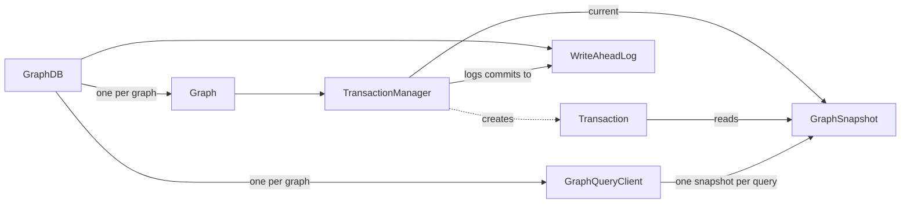
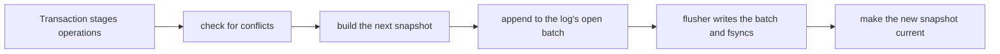
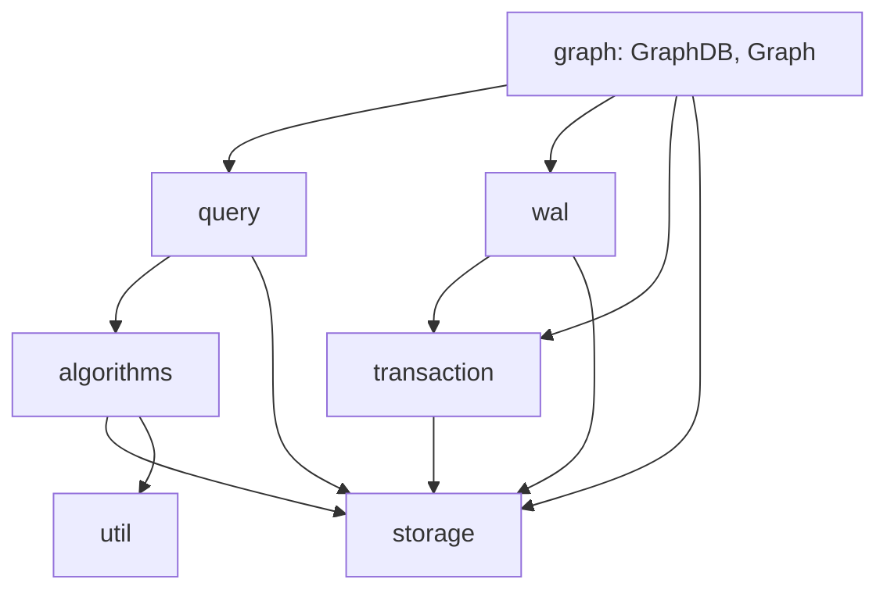

# Architecture overview

GraphDB is an embedded graph engine: a Java library that runs inside your own process instead of as a server. This
page shows how the project is put together: the main objects, how a write and a read move through them, the package
layers, and the design decisions everything else rests on. The other pages go into each part in depth.

## The main objects

- **`GraphDB`** owns a data directory. It holds the write-ahead log, which all its graphs share, along with its
  graphs and a query client for each graph. Opening it replays the log to rebuild the graphs.
- **`Graph`** is the read view of one graph, and creates transactions on it.
- **`TransactionManager`** holds the graph's current snapshot and runs every commit. It is the only code that
  changes a graph.
- **`GraphSnapshot`** is one committed state of the graph. It never changes; each commit makes a new one.
- **`Transaction`** reads from the snapshot it began on and stages its writes until `commit()`.
- **`GraphQueryClient`** runs algorithms, each on one snapshot, and caches their results.

## How a write flows

A transaction records its writes as a list of operations. On `commit()`, the `TransactionManager` checks them
against what other transactions appended since this one began, applies them to a copy of the newest snapshot, and
appends them to the log. The log's flusher thread writes every commit appended since its last flush and forces them
to disk together. Once its commit is durable, the `TransactionManager` swaps the new snapshot in. Readers, new
transactions and queries see it from then on. See [Transactions](transactions.md) and [Durability](durability.md).

## How a read flows

A read takes the current snapshot and reads only that. `Graph` reads take it once per call, a transaction keeps the
snapshot it began on, and a query takes one snapshot for its whole run. Snapshots never change, so none of these
needs a lock, and none of them can see part of a commit. See [Storage](storage.md) and
[Query engine](query-engine.md).

## Package layers

All code lives under `graph`. Each arrow means "depends on". `model` and `exceptions` are left out because nearly
every package uses them.

| Package | What it owns |
|---|---|
| `graph` | The public entry points, and the wiring between the other packages |
| `graph.model` | `Node`, `Edge` and the read interfaces |
| `graph.storage` | Snapshots, and the builder that makes the next one |
| `graph.transaction` | Transactions, the commit path and conflict detection |
| `graph.wal` | The write-ahead log and recovery |
| `graph.query` | `GraphQueryClient` and its query classes |
| `graph.algorithms` | The algorithms, their result types and the result cache |
| `graph.exceptions` | Every exception the engine throws, all of them unchecked |
| `graph.util` | Small data structures, such as the LRU cache |

`ArchitectureTest` enforces two rules on these packages:

1. **Nothing depends on the root package.** The root package creates the objects and connects them, so every other
   package can be understood and tested on its own.
2. **There are no cycles between packages.**

The second rule shapes one part of the design. A commit has to be logged, but `transaction` cannot depend on `wal`,
because `wal` already depends on `transaction` to encode its operations. Instead, `transaction` declares the
interface it needs, `CommitLog`, and `WriteAheadLog` implements it. `GraphDB` connects the two.

## Design decisions

- **Committed state is an immutable value.** Snapshots are built from persistent maps, so making the next one
  copies very little and readers never lock. See [Storage](storage.md).
- **There is one write path.** All changes go through a transaction and the `TransactionManager`. Only the commit
  path and recovery build snapshots. The read-only and writable storage interfaces are separate, so a half-built
  graph cannot be passed to code that reads one.
- **Operations are the unit of change.** One operation list is applied to build the next snapshot, recorded in the
  log and replayed by recovery, so the live graph and the recovered graph cannot disagree.
- **The log comes before visibility.** A commit is written and forced to disk before it is published.
- **Commits share `fsync`s.** No lock is held while waiting for the disk, so commits from any number of threads and
  graphs are forced together by one flusher thread.
- **`Node` and `Edge` are immutable.** Their attribute maps, including nested lists and maps, are unmodifiable
  copies, so the objects reads return can be shared freely and cannot be used to change the graph.
- **Standalone graphs skip the log.** `Graph.createGraph()` makes an in-memory graph whose commits are not logged.
  Only graphs created through a `GraphDB` are durable, and only they can be queried through the public API.
