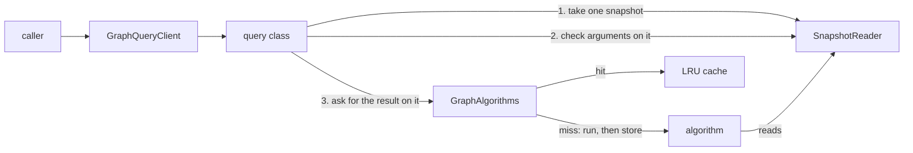

# Query engine

The query engine runs graph algorithms, such as shortest paths, cycle detection and connected components, on one
committed snapshot, and caches their results. Callers use `graph.query`, and the algorithms and the cache are in
`graph.algorithms`.

## How a query runs

1. `GraphDB.createQueryClient(graphId)` returns the graph's `GraphQueryClient`, and every call returns the same
   client. The client groups the queries into `paths()`, `connectivity()`, `cycles()`, `structure()` and
   `commonality()`.
2. The query class takes the graph's latest snapshot once and checks the arguments against it. For example, it
   checks that every node the caller names exists.
3. `GraphAlgorithms` returns the cached result if there is one. Otherwise it runs the algorithm on that same
   snapshot and caches the result.

### One snapshot per query

A query reads a single snapshot from start to finish. So it never mixes two committed states, however long it runs
or however many commits land in the meantime. Queries and commits never block each other. Separate query calls take
separate snapshots, so two queries in a row can see different states.

## The queries

| Group | Queries | Algorithms |
|---|---|---|
| `paths()` | shortest path, all paths, paths up to a length, all-pairs distances | Bellman-Ford (default), Dijkstra, depth-first search, Floyd-Warshall |
| `connectivity()` | are two nodes connected, reachable nodes, strongly connected components | depth-first search, Tarjan (default) or Kosaraju |
| `cycles()` | has a cycle, is a DAG, has a negative cycle, all cycles | depth-first search, Bellman-Ford, Johnson |
| `structure()` | in- and out-degree, diameter, topological sort | direct reads, Floyd-Warshall, depth-first search |
| `commonality()` | common neighbours, common nodes at or within a depth | breadth-first search |

Each algorithm is its own class, grouped into sub-packages by family. Algorithms read the graph only through the
`GraphView` interface, so they do not depend on how storage works.

Results such as `Path`, `DistanceMatrix`, and lists of sets are deeply unmodifiable. They have to be, because
every caller and thread that asks the same question shares the same cached object.

## Caching

Each query client has one least-recently-used cache of 20 results.

- **The key is the snapshot version, the algorithm and the arguments.** A result is stored under the version of
  the snapshot it was computed on, so it can never be returned for a different snapshot. Commits do not need to
  invalidate anything. Entries from older versions are never hit again, and newer entries push them out.
- **The algorithm runs outside the cache lock.** A long computation never blocks other queries. If two threads miss
  on the same key, both compute it. Both results are for the same version, so keeping either one is correct.
- **Failures are not cached.** If an algorithm throws, the next call runs it again.
