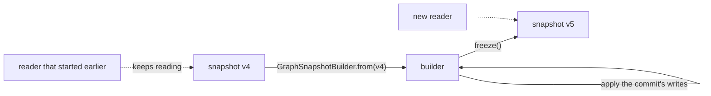

# Storage

This page explains how a graph is held in memory. The code is in `graph.storage`.

## The idea

A committed state of a graph is an **immutable value** called a `GraphSnapshot`. A commit never changes a snapshot.
It builds a new snapshot from the current one and swaps it in. Anyone still reading the old snapshot keeps reading
it, unaffected.

Everything else follows from this idea. Readers never lock, because what they read cannot change. A transaction
remembers the snapshot it began on. A query runs on one snapshot from start to finish. Old snapshots need no
cleanup: once nothing refers to one, the JVM's garbage collector frees it.

## What a snapshot holds

A snapshot holds nodes and edges by id, along with the indexes the reads need:

- **outgoing and incoming adjacency**: for each node, its neighbours and the edge to each one. Together they also
  enforce that a pair of nodes has at most one edge in each direction;
- **incident edges**: every edge that touches a node, so deleting a node can find them all;
- **edges by weight**: a sorted index for weight lookups and range queries.

It also has a **version** number (see [Versions](#versions)).

## Why persistent maps

Each of those maps is a *persistent* map from the PCollections library. A persistent map is immutable, but an
update is cheap: `map.plus(key, value)` returns a new map that shares almost all of its internal tree with the old
one. The old map is left exactly as it was.

This makes each snapshot a small object that points to a few maps. Building the next snapshot means applying a
commit's writes to those maps. The rest of the graph is shared with the previous snapshot, not copied. Persistent
maps give the engine multi-version concurrency without per-row version chains, visibility checks on every read, or
a background process that cleans up old versions.

The trade-off is that each write allocates a few small tree nodes, and a lookup walks a tree instead of hitting a
hash table.

## Building the next snapshot

The only way to make a snapshot other than the empty one is `GraphSnapshotBuilder`:

1. `GraphSnapshotBuilder.from(snapshot)` starts from an existing snapshot.
2. The writes `putNode`, `removeNode`, `putEdge` and `removeEdge` each replace one or more of the builder's maps
   with updated versions.
3. `freeze()` returns the result as a new snapshot.

A builder is used in exactly two places: the [commit path](transactions.md#the-commit-path) and
[recovery](durability.md#recovery). Everything else reads the read-only `GraphStorage` interface, which only
snapshots implement. The builder implements only the writable `MutableGraphStorage`, so the compiler rejects passing
a half-built graph to code that reads one.

### Writes are defined for every input

A builder write never fails. Removing a node or edge that is not there does nothing. Removing a node also removes
every edge that touches it. If another edge already holds a node pair's slot, putting a new edge on that pair gives
the slot to the new edge.

Recovery depends on this. It replays the write-ahead log through these same writes, and a log written by an older
version of the engine can contain data that today's commit validation would reject. Replay has to apply that data
the way the original commit did.

## Reading a snapshot

`SnapshotReader` wraps one snapshot and provides the full read interface, `GraphReader`. It adds the read rules on
top of the raw maps. For example, asking for a missing node throws `NodeNotFoundException` instead of returning
`null`.

Each read on a `Graph` takes the latest snapshot, wraps it in a reader and delegates to it. So a single read call
never sees part of a commit, although two calls in a row may see different snapshots. Reads inside a transaction
work differently; see [Transactions](transactions.md#reads-inside-a-transaction).

## Versions

The empty graph is version 0, and so is each graph that recovery rebuilds. Each commit that changes something
produces the next version. The query cache uses the version to tell snapshots apart (see
[Query engine](query-engine.md#caching)). Versions are meaningful only within one graph during one run.
