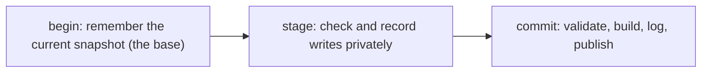
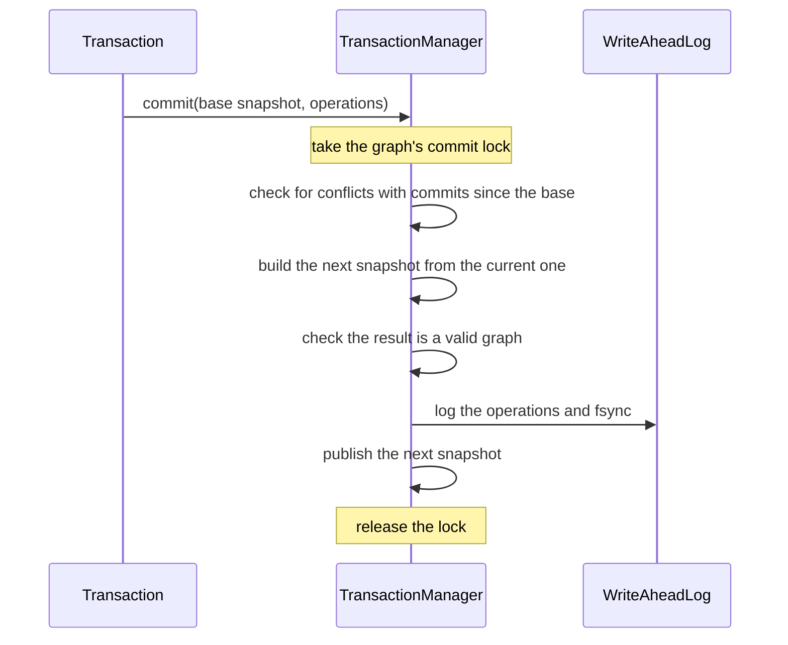

# Transactions

Every change to a graph goes through a `Transaction`. Every transaction commits through one path, in the graph's
`TransactionManager`. The code is in `graph.transaction`.

## Lifecycle

1. **Begin.** `graph.createTransaction()` creates a transaction, which remembers the latest committed snapshot as
   its **base snapshot**.
2. **Stage.** Writes such as `addNode`, `updateEdge` and `deleteNode` are checked and recorded inside the
   transaction. No one else can see them.
3. **Commit.** `commit()` hands the staged changes to the `TransactionManager`, which turns them into the graph's
   next snapshot.

A transaction is used once: after `commit()`, whether it succeeds or fails, the transaction accepts no more writes.
A transaction is not thread-safe, so only one thread may use it at a time. There is no rollback call. A transaction
that is never committed is simply dropped.

## Staging writes

Each write is first checked against what the transaction can see. For example, the nodes it names must exist, and
an edge's two endpoints must not already have an edge between them in that direction. A write that fails this check
throws and stages nothing. Writes staged before it stay staged.

A write that passes is recorded in two forms:

- **The changed objects.** `Node` and `Edge` are immutable, so an update builds a new object with the change
  applied. The transaction's later reads see the new object.
- **An operation** appended to an ordered list. There are four kinds: `AddOrUpdateNode`, `DeleteNode`,
  `AddOrUpdateEdge` and `DeleteEdge`. A put carries the complete new node or edge, not a diff.

The **operation list** is the central idea. A commit applies it to build the next snapshot, the write-ahead log
records it, and recovery replays it. All three run the same operations through the same code, so the live graph and
the recovered graph cannot disagree.

Deleting a node stages a delete for each of its edges, followed by the node delete. The explicit edge deletes mean a
concurrent change to one of those edges is detected as a conflict.

## Reads inside a transaction

A `Transaction` has the same read interface as a `Graph`. It shows the base snapshot with the transaction's own
changes laid on top: staged objects replace or add to the snapshot's, and deleted ones are hidden. Commits that
other transactions make after this one began are never visible to it.

## The commit path

The order of these steps is what makes commits safe:

- **Validate and build before logging.** Every commit that reaches the log can be published.
- **Log before publishing.** Readers never see data that a crash could lose.
- **Do all of it under one lock per graph.** Commits to one graph happen one at a time, so the log records them in
  the order readers saw them.
- **Publish with one reference swap.** The current snapshot is a `volatile` field. A reader sees either the whole
  commit or none of it (see [Concurrency](concurrency.md#publishing-a-snapshot)).

If any step fails, the current snapshot is left as it was. A transaction with no staged writes returns from
`commit()` straight away and does nothing.

## Conflict detection

GraphDB uses **snapshot isolation with first-committer-wins**. When two transactions write the same thing, the one
that commits first wins. The other gets a `TransactionConflictException`.

At commit time, the transaction's writes are compared with what other transactions committed since its base
snapshot. The transaction is rejected if:

- **(a)** a node or edge it writes was changed or deleted by someone else;
- **(b)** an edge it adds or updates is on a node pair whose edge someone else changed;
- **(c)** in the snapshot this commit would produce, an edge it adds or updates is missing an endpoint, or does not
  hold its node pair's slot.

Rules (a) and (b) compare object identity, not equality. Every staged write creates a new object, so if the
object is the same in the base snapshot and the current one, nobody wrote it in between. Rule (c) runs on the newly
built snapshot, so it accounts for concurrent commits and the transaction's own writes together. Only the ids the
transaction writes are checked, so a small transaction validates quickly however large the graph is.

Some examples (`TransactionConflictTest` covers each one):

| Situation | Result |
|---|---|
| Two transactions update the same node | The second to commit is rejected (a) |
| One deletes a node; another updates one of its edges and commits first | The delete is rejected (a) |
| Two transactions each add an edge A→B | The second is rejected (b) |
| One deletes node A and commits; another then tries to add an edge A→B | The edge add is rejected (c) |
| Two transactions write different nodes and edges | Both commit |

### Write skew

Only what a transaction **writes** is checked, never what it only **read**. Suppose a rule says "at least one of
edges e1 and e2 must remain". Two transactions each see both edges, and one deletes e1 while the other deletes e2.
Their writes do not overlap, so both commit, and the rule is broken. This is **write skew**, and snapshot
isolation allows it. GraphDB does not prevent it. An application with a rule like this can make both transactions
write a shared node, so that they conflict.

## When commit fails

- `TransactionConflictException`: someone else committed a conflicting write first. Start a new transaction, read
  again and retry.
- `WalException`: the log could not be written (see [Durability](durability.md#write-failures)). Retrying in a
  loop rarely helps.
- `IllegalStateException`: this transaction was already committed.

Whatever the failure, nothing was published, and the transaction cannot be used again.
